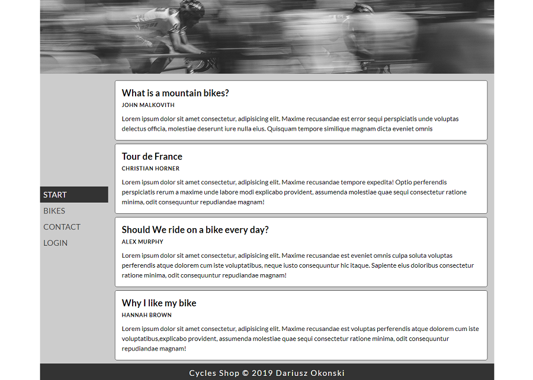

# Cycles Shop WebPage in React

Cycles Shop WebPage it is a create react app. It was created for desktop and mobile views. App is using react-router-dom
and components such as BrowserRouter, Link, Route. React-router-dom allows to switch between diffrent views of an app.

## Tools & Technology used

- Visual Studio Code
- React
- React-router-dom
- HTML
- SCSS
- FLEXBOX
- media queries
